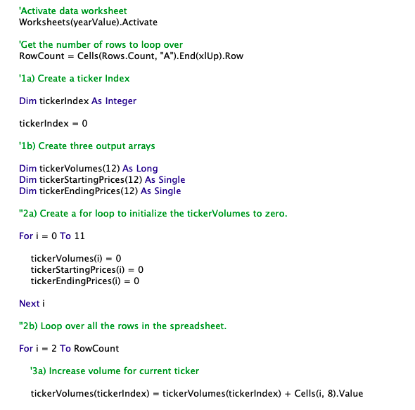

# stock-analysis

## **Overview of Project**

The purpose of this analysis was to collect and analyze stock information for 12 different stocks to assess the performance of each stock. With this information we can gather stock performance data for various stocks over multiple years (2017 and 2018) to determine whether or not the stocks would be worth investing in. This project sought to refractor the VBA starter code we created during the module so we loop through the dataset only once to gather the data. All other elements of the analysis remained the same (stock tickers of interest, data points of interest, years of analysis and conditional formatting of data to visualize assess performance).

To collect this data for the analysis, we needed to be able to identify the year (worksheet) in the dataset to pull the data from, reference the ticker values to tally the total daily volume and return for each ticker and each year where we had data available. Lastly, we had to output the data and analysis collected from our code into a new sheet in the workbook to reference and review the performance of the 12 stocks of interest.

For copy of the dataset used in this project analysis, click [here](https://github.com/pahlor/stock-analysis/blob/main/Module2Challenge/VBA_Challenge.xlsm).

#### *Screenshots of refractored code:*

## **Results**
After completing and running my refractored code, I compared my stock analysis outputs for both years, 2017 and 2018, to the outputs from the VBA code that was created during the module to confirm the outputs received from both codes were the same. Outputs from both the refractored code and the original code were the same.

When we run the original code from the module, both of the run times for 2017 and 2018 stock data analyses were close to almost 1 second each (0.711 seconds for 2017 and 0.719 seconds for 2018). Using the refractored code, we find the run time to complete the analyses has significantly reduced in comparison (going down to 0.180 seconds for 2017 and 0.141 seconds for 2018 respectively).

Below are screenshots of the run time for the 2017 and 2018 analyses using the refractored code. Run times for both years using the refractored code were below 1 second each. The run time for  

###### *2017 Stocks Analysis Run Time (using refractored code):*

###### *2018 Stocks Analysis Run Time (using refractored code):*

## **Summary**

### Advantages and Disadvantages of Refractoring Code
When we refractor code, we can improve upon existing code in many ways. One of the reasons we would want to refractor code is to increase efficiency in our run time to execute the code. A contributing factor to increased efficiency when refractoring code is that in the process of refractoring we are making improvements to the existing code that would This makes our code cleaner and easier to work with. Cleaner code takes less time to run, uses up less memory, and makes it easier to understand to build upon and enhance for future projects and improvements. When refractoring code, it's important that we keep the changes small so as not to alter the behavior and structure of the code.

### Original VBA Script Compared with Refractored VBA Script
With small adjustments to our original code, we were able to reduce the time it took to run and complete each analysis. When we run the original code from the module, both of the run times for 2017 and 2018 stock data analyses were close to almost 1 second each (0.711 seconds for 2017 and 0.719 seconds for 2018). From the screenshots above of the run times for 2017 and 2018 stock data analyses using the refractored code, we find the run time to complete the code is significantly reduced in comparison. The core strucutre and behavior of both sets of code (original and refractored) remained essentially the same. The original VBA code had us loop through the data multiple times to collect all of data we wanted to count and extract. The new code looped through the data only once and in the new code we identified a way to count and tally the data directly into the output array.

